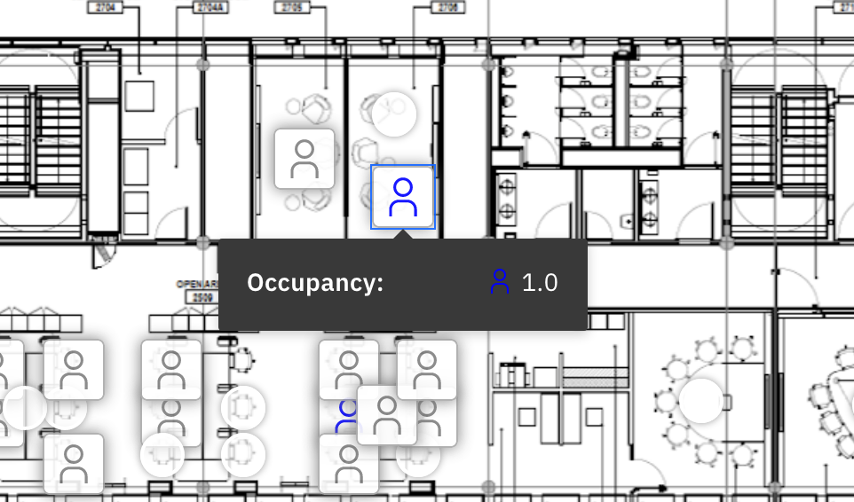
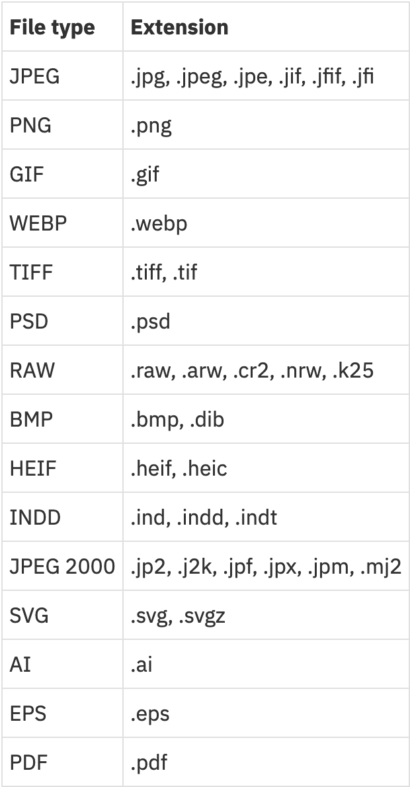
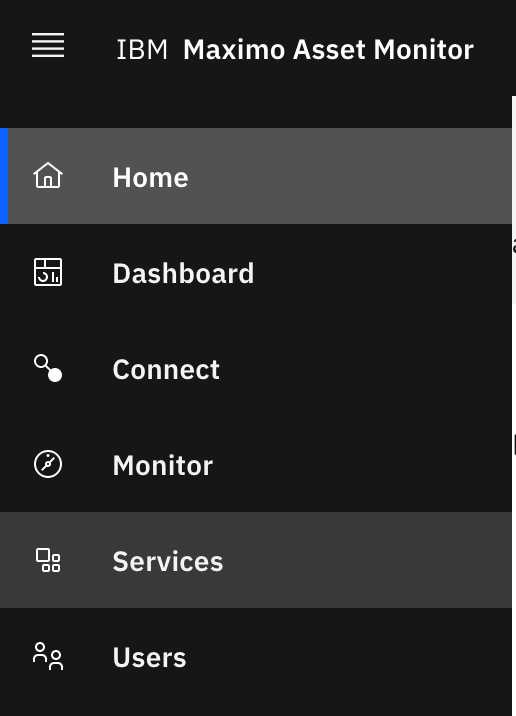
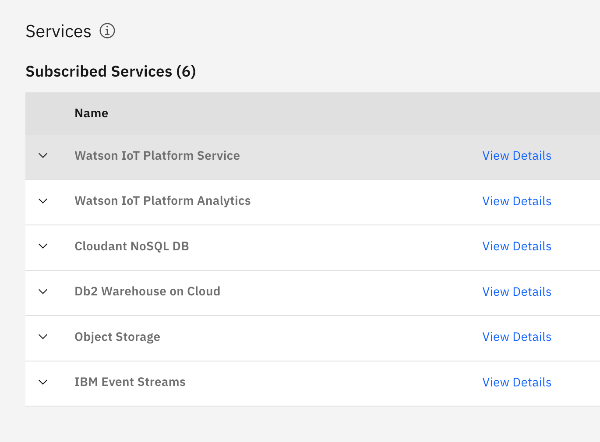
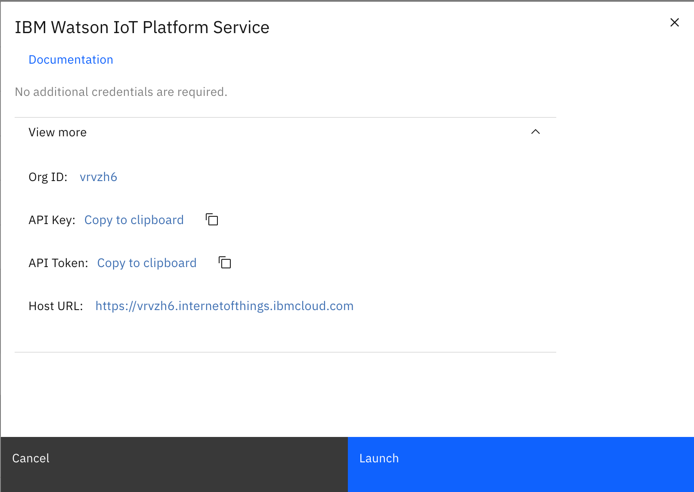

# Create Image Card

In Maximo Asset Monitor, images can add a tremendous amount of value to data visualization when paired with graphs, tables, and value cards. Using a REST API call, you are able to push an image of your choosing into the Monitor data lake and display this image on your dashboards. You are also able to place icons which called hotspots on the image cards. These icons are tied to data from individual sensors or an aggregate of all of the sensors on a summary dashboard. Inside of the JSON configuration for the image card, you are able to set alert conditions that change the icon on the hotspot.
 &nbsp;

**Here is what you see when you click on one of the hotspots.**

 &nbsp;

The image card above displays an occupancy use case. Individual occupancy sensors have been tied to each hot spot to indicate whether seats in a meeting room in the Munich IoT center are occupied. The image above shows a much more complicated image card with hotspots than you will be creating in this lab, but this example is something that you could use eventually in the real world.

In this lab, you will learn how to select a photo for your image card, push your image into the Monitor data lake using a REST API call, and finally display your image card on a dashboard in Monitor. You will need Postman for this section. Please download the application at this link if you have not already: https://www.getpostman.com/
## Upload Image to Monitor Datalake
### Choose Image
1. Choose an image that allows you to use hotspots to tell a meaningful story. For example, choosing a floor plan of a factory floor where you can tie hotspots to assets on the floor would tell an important and meaningful story.
2. Choose an image that is **smaller than 1MB**. Your API call will not be successful if you try to push a larger file.
3. These are the types of files that you can push into the Monitor data lake.
 &nbsp;
### Obtain API Key
1. Open up your Maximo Asset Monitor tenant.
2. Open up the hamburger menu on the left side and select `Services`.
 &nbsp;
3. Next to `Watson IoT Platform Service`, click `View Details` and then click  `View More`.
 &nbsp;
4. Copy and paste the `API Key`and `API Token` into a Notes application of your choosing. It is good to save this information in a place that is easy to access. You will most likely use this API Key and Token again.
 &nbsp;
5. Copy and paste the API Key and Token you obtained into Postman.
 &nbsp;
### Push Image to Datalake using Postman
## Display Image Card on Dashboard
### Create Image Card JSON Object
