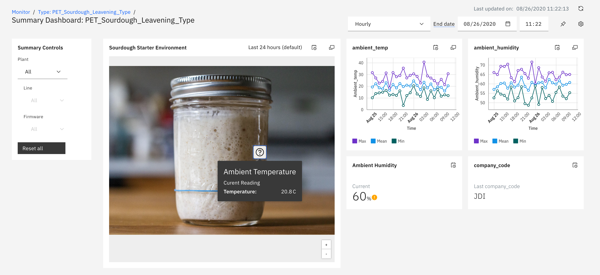
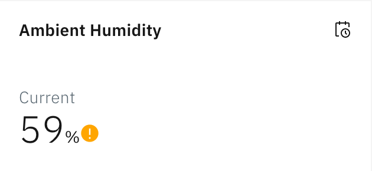
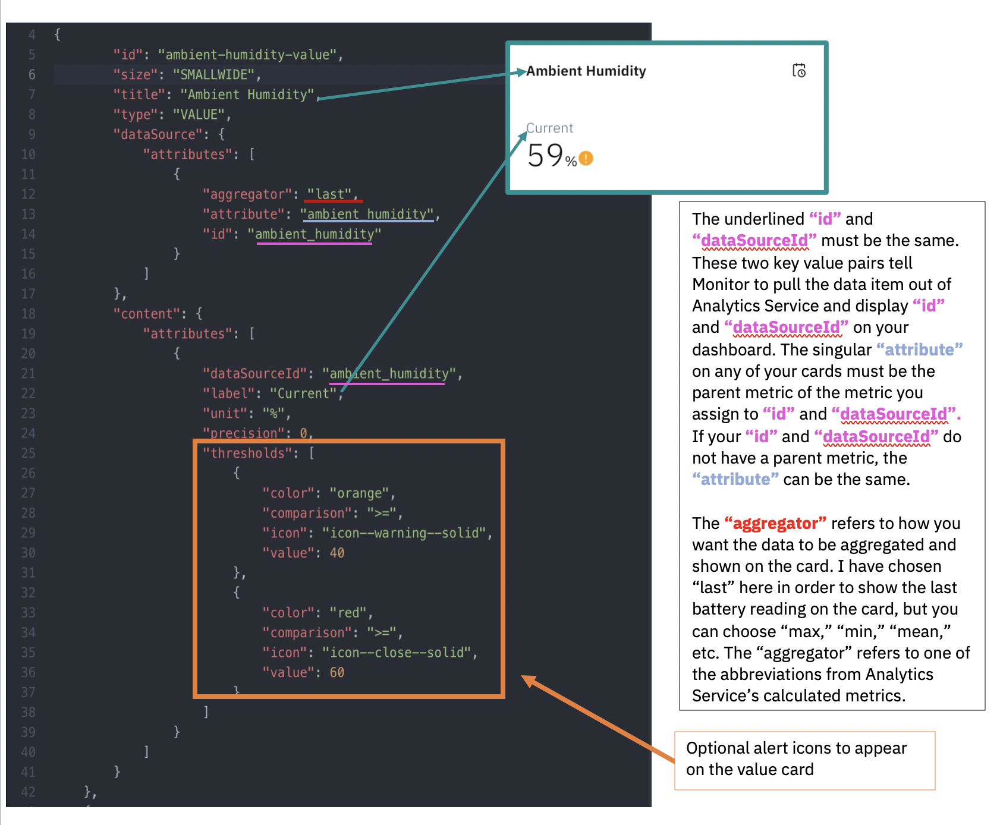

# Create Value Card
A great way to augment your Maximo Asset Monitor dashboards is with value cards. This type of card allows you to display a metric or multiple metrics on a card and is a good way to show the status of an asset. You are also able to set alert thresholds within the JSON to have different icons appear on the card to indicate a positive or negative status. Here is an example of a complex value card: This value card is a stacked value card. The JSON to create a card like this can be located [here](https://atom.io/). In this lab, you will learn to make a more simple value card in order to best learn the theory behind the JSON mapping. You will make a value card that will look like the value card shown on the dashboard below.

 &nbsp;
## Export Dashboard JSON
1. Open up the landing page for your entity type and select the dashboard you will be uploading your image card to.
2. Click on the gear in the top right of your chosen dashboard.
 &nbsp;
3. Click `Edit Dashboard`.
 &nbsp;
4. Click `Export` and save your JSON into a folder that you can keep handy. Make sure to save the file with the file extension `.json`. Open the file in a text editor of your choice. Here are some good open source options: [Atom](https://atom.io/), [Brackets](http://brackets.io/), and [Sublime](https://www.sublimetext.com/).
## Add Value Card JSON
In this section, you will learn the framework for a value card. Using the framework below, map the data items that are in your Entity type to display your image card on a summary dashboard. Replace the data items in the above JSON with the applicable data items, titles, and other information from the Entity Type you are working with to tell the story you are trying to tell. This section shows you how to create this value card:
 &nbsp;

1. Please copy and paste the JSON code block below into the top of your `cards` array.
 &nbsp;
``` yaml
{
        "id": "ambient-humidity-value",
        "size": "SMALLWIDE",
        "title": "Ambient Humidity",
        "type": "VALUE",
        "dataSource": {
            "attributes": [
                {
                    "aggregator": "last",
                    "attribute": "ambient_humidity",
                    "id": "ambient_humidity"
                }
            ]
        },
        "content": {
            "attributes": [
                {
                    "dataSourceId": "ambient_humidity",
                    "label": "Current",
                    "unit": "%",
                    "precision": 0,
                    "thresholds": [
                        {
                            "color": "orange",
                            "comparison": ">=",
                            "icon": "icon--warning--solid",
                            "value": 40
                        },
                        {
                            "color": "red",
                            "comparison": ">=",
                            "icon": "icon--close--solid",
                            "value": 60
                        }
                    ]
                }
            ]
        }
    },
```
2. The information below gives you the tools you need to map the data items in your Entity Type to the card you will display with your JSON code.
 &nbsp;
Some other important notes about the JSON:
-	The `id` at the very top needs to be a unique name for this card. Use dashes instead of spaces.
-	The `size` is self explanatory. This size is `SMALLWIDE`
-	The `type` is the type of card such as `VALUE`, `TIMESERIES`, or `IMAGE`.
-	`unit` is the unit of measurement belonging to your data item.
-	`precision` refers to the number of decimal points to be seen.

3. Once you feel that you have correctly mapped the data items from your entity type into the above JSON format, save your file with your finished value card. **Be sure to employ version control and save your file with a new name every time you make serious changes in case you make an error. You want to make sure you always have a working file.**
## Import Dashboard JSON
1. 1. Open up the landing page for your entity type and select the dashboard you will be uploading your image card to.
2. Click on the gear in the top right of your chosen dashboard.
 &nbsp;
3. Click `Edit Dashboard`.
 &nbsp;
4. Click `Import` and select the file that you have just been working on. If you are successful, a small grey square will appear among your line graphs to drag and drop until you are satisfied with the layout. If you are unsuccessful, you will receive an error. The error message will notify you of something to change. Another option is to use a JSON parser on the internet that will notify you if your JSON has discrepancies. If at first you do not succeed, try, try again!
