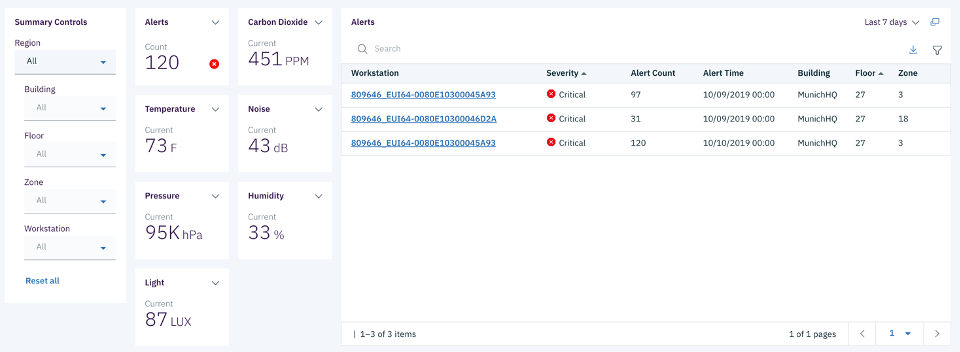

# Creating a Hierarchy with Dimensions

In Maximo Asset Monitor, dimensions are a way of aggregating your sensor data in different hierarchical categories and locations. Using a REST API call, you are able to push JSON into the Monitor data lake to assign dimensions to different sensor device IDs.  

Let’s look at an application of dimensions in Monitor. Dimensions in Maximo Asset Monitor allow for rapid actionable insights. The Workstation demo showcases the IBM IoT Center in Munich which has been outfitted with sensors to measure comfort and occupancy. Our developers added the following dimensions: Region, Building, Floor, Zone, and Workstation. Right when you log in to the Building Summary dashboard, you can see on the alerts table that all 120 alerts for October 10 came from the Munich HQ building on the 27th floor in Zone 3. The dimensions allow you to tie your sensors with a specific location which allows you to be able to drill down into Zone 3 inside of the dashboard or physically go to Zone 3 and check out the problem.  
 

To set up your own dimensions, you will need to open up Postman. If you do not already have Postman downloaded, here is a link to download the software https://www.getpostman.com/. 

## Obtaining an API Key
In order to successfully push your JSON schema into the Monitor platform, you will need an API key and token to authenticate your POST request. We will obtain this API key and token by creating one in the Watson IoT Platform Service application linked to your Maximo Asset Monitor instance.

1. In the hamburger menu on the left side of the screen of Maximo Asset Monitor, click `Connect`.
2. To the right of where it says `Watson IoT Platform Service` click `View Details`.
3. Now click the `Launch` button.
4. 

## Creating a Value Card

## Uploading an Image

## Creating an Image Card

## Creating a Table Card
