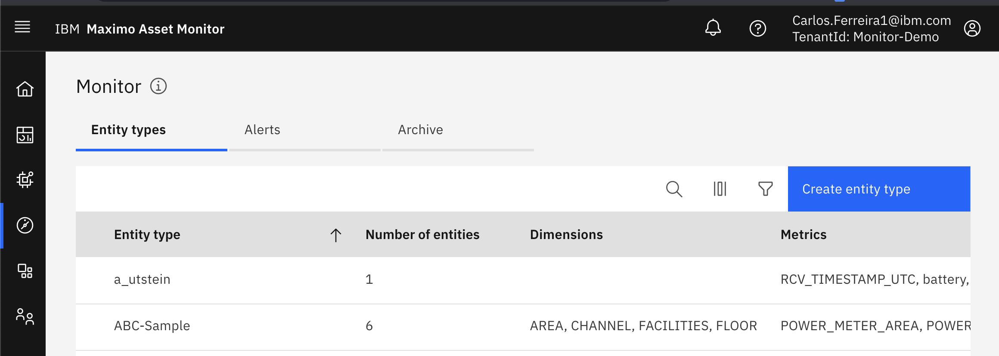
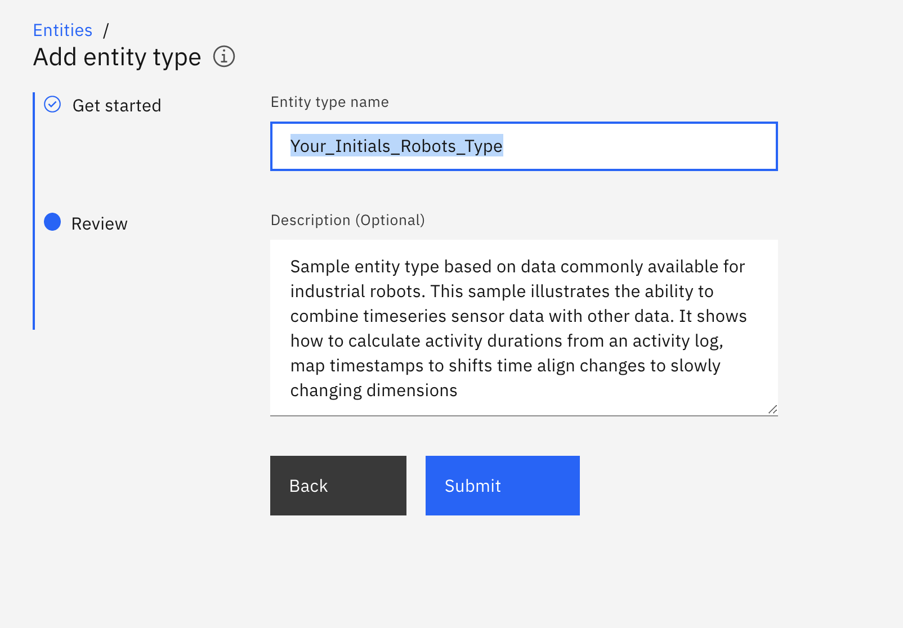
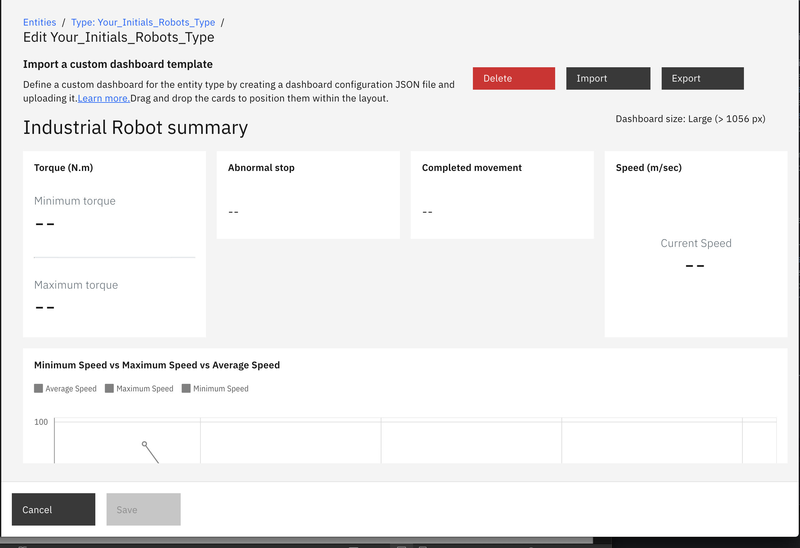
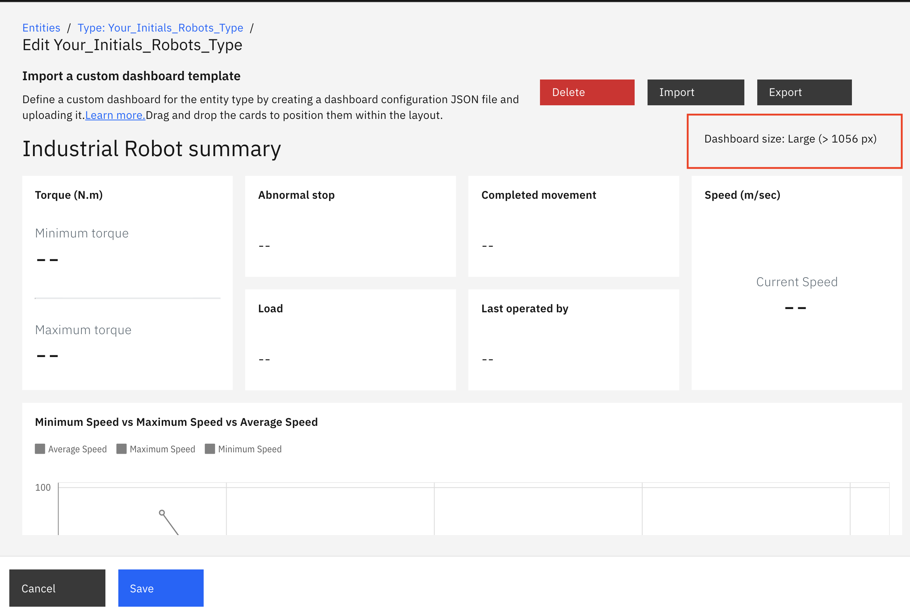

# Before You Begin
This lab requires that you have completed the pre-requisites required for [all labs](../facilitator_instructions)

# Objectives
In this lab you will learn how to:

*  Create an asset instance dashboard and a summary dashboard that aggregates asset performance metrics across multiple assets
*  Detect anomalies by applying anomaly models
*  Create alerts to prioritize anomalies
*  Monitor alerts across multiple assets in a summary dashboard you create
*  Troubleshoot to find the rood cause of a problem

You will use data from simulated industry robots as the assets you are responsible to monitor. Monitor provides simulated anomalies that you can apply to learn about anomaly detection.

## Create Simulated Robots to Monitor
1.  Click `Home` to see the top level tasks you can do with Monitor.  &nbsp;
2.  Click `Monitor Entities` You will create a simulated set of robot assets (entities) that represent an assembly line of manufacturing robots.
3.  Click `Create entity type` button.  &nbsp;
4.  Select on `Sample Robot` and click on `Next`button.   &nbsp;
5.  Edit the Entity Type name prepending your own initials `Your_Initials_Robots_Type`. &nbsp;
6.  Click `Submit` button.  Monitor will create  a set of robots you can monitor with simulated random data.  

## Explore Instance Dashboards
An instance dashboard displays the operational metrics for a single entity, i.e. one specific industry robot. The data metrics of the robot are presented on the dashboard using cards.

1.  On the `Data` tab, expand `Metric` to see the metrics that Monitor has created for your Robots with simulated time series data.   The outline shows the acc, load, speed and torque metrics in the data items outline.  &nbsp;
2.  Expand  `Dimensions` to see the classifications Monitor has created to filter and summarize all the Robots key performance metrics like by `Manufacturer`.  &nbsp;
3.  Expand  `Metric (calculated)` to see the functions used to create the simulated data like generating a random number to cause a fault like `abnormal_stop_count`. 
4.  Click the `Dashboards` tab to  to see the list of `Entities`(Robots) in the `Instance Dashboards` table.
5.  Click one of the Robot instance dashboards that have been automatically created for you by Monitor.  &nbsp;
6.  Click on the `Back from` calendar drop down to see historical performance metrics of this robot.    &nbsp;
7.  Note the different types of [cards](https://www.ibm.com/support/knowledgecenter/SSQP8H/iot/dashboard/cards_json_ref.html) in your dashboard.  Monitor provides multiple types of cards to choose from when configuring a dashboard.

### Value Cards
A value card shows a single or multiple entity metric value. A value may be attributed with a title, a label and a unit. The value may be given a precision and rules on threshold levels.  A value card may be sized as a wide or tall card with big or small sized numbers.

### Line Graph Cards
A line graph card shows time-series data from a single or multiple entities as a graph with time and value axes. The graph may be given a title and labels on the axes. The line graph may be shown in full screen mode and is added a data table with the metrics values plotted in the graph.
A line graph may also be overlaid with an Alert metric indicating any anomalies on the metric.

### Table Cards
A table card shows tabular data by columns. A table card is configured by referencing some data source for each column. The table may group data source values and present a count rather than each individual value.
An Alerts Table is a preconfigured table presenting alert information.
Image cards
An image card shows as a custom image with configured hotspots. Each hotspot is indicated at a position on the image with an icon and configured as a value card with entity metrics. The value card is shown when clicking on the hot spot.

## Edit Dasbhoard Layouts
In this exercise you will  modify the layout of the instance dashboard.  An instance dashboard is a configuration of cards, layout and the datasource metrics for a specific asset. One instance dashboard json configuration file is used for all robots of your Robot Entity type.  You can export and dashboard configuration file adding new cards.  You can also reuse and import dashboard configuration files from others.

1.  Click the `gear icon` to modify the layout of your Robot instance dashboard.  This dashboard template is shared by all robots in your Entity Type.  &nbsp;
2.  Monitor provides a responsive user interface as the display size of the device or browser window changes you can reposition the cards.  Change the layout of your dashboard by dragging cards around with you mouse.  &nbsp;
3.  Once you are satisfied with the layout, change the width of the browser window to a smaller size.  Note the `Dashboard Size` of the layout has changed.  Once again change the layout of your dashboard by dragging cards around with your mouse.  &nbsp; The dashboard configuration saves all the adjustments you make to the layout for each resize your browser window.
4.  Click on `Export` button. The dashboard configuration file is saved to your local downloads directory on your computer.
5.  Click on `Save` to save the new dashboard layout.

Note: The graph shows a statistical aggregation of the torque data item across all your robots. Hence the torque values may be shown as the Max and Min values of torque.

# Create a Summary Dashboard
In the previous exercise you created an instance dashboard for each Robot.   In this exercise you will

## Add Line Graph Cards
Time series data is represented well as line graphs. Let's display the the critical performance metrics the Thingy is providing so that we can see historical trends and in later labs apply ai models to detect anomalies.

1.  Navigate back to the landing page for your entity type. You will see under “Summary Dashboards” an option to create a new dashboard. Click `+New Summary`.
2.  Next to `Definition`, click `Contents`. Select which data you would like to graphed on your dashboard.  
3.  Select which aggregation methods  you would like to see on your line graphs for each of your data types (You created these in the Analytics Service chapters).
4.  Now, click `Dashboard` next to contents. You can drag and drop the line graph cards that you just made in whichever orientation you see fit.
5.  Once you are content with your dashboard layout, click `Create Summary`. After a few minutes, you will end up with the beginnings of a sophisticated and value driven dashboard.
6.  Copy and paste the JSON lines 3 to 158 from “Monitor Final JSON without Image.json” into the top of the card array of your exported JSON. Copy and paste the JSON from my file beginning at the curly brace on line 3.

You are adding a few value cards to your dashboard. Please refer to the Full Hands on Lab in the Box folder if you would like to go through the whole lab.

Be careful of your commas, curly braces, and brackets or your JSON will get angry. In Atom, you can click on the curly brace at the top of your value card and it will underline that brace blue along with the last curly brace of the card. Make sure to put a comma after the last curly brace before the beginning of the next card.

You have finished the  "Operational Monitoring of Assets" lab.
