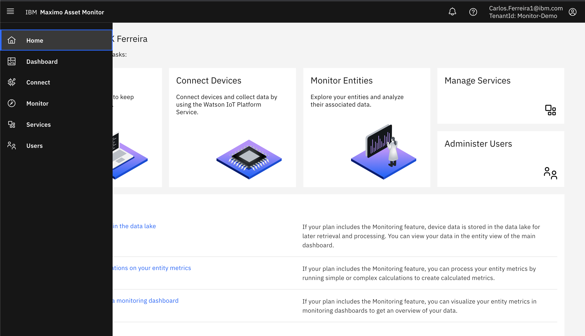
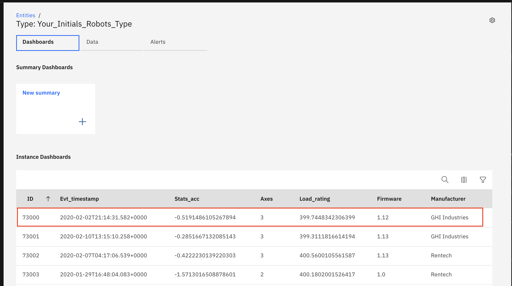
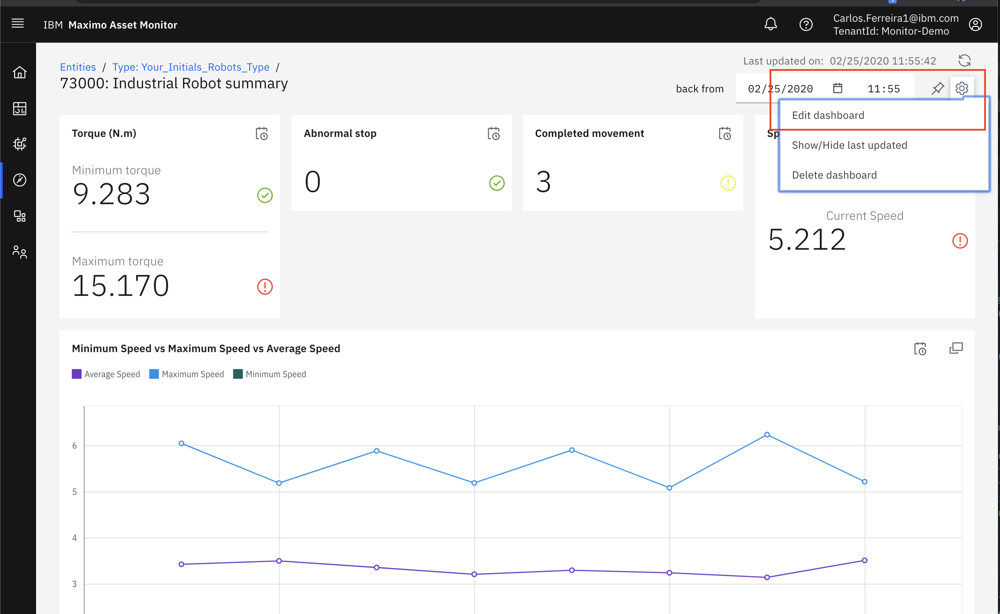

In this lab you will learn how to:

*  Create an asset instance dashboard and a summary dashboard that aggregates asset performance metrics across multiple assets
*  Detect anomalies by applying anomaly models
*  Create alerts to prioritize anomalies
*  Monitor alerts across multiple assets in a summary dashboard you create
*  Troubleshoot to find the rood cause of a problem

You will use data from simulated industry robots as the assets you are responsible to monitor. Monitor provides simulated anomalies that you can apply to learn about anomaly detection.

## Create Simulated Asset Robots to Monitor
1.  Click `Home` to see the top level tasks you can do with Monitor.  &nbsp;
2.  Click `Monitor Entities` You will create a simulated set of robot assets (entities) that represent an assembly line of manufacturing robots.
3.  Click `Create entity type` button.  &nbsp;
4.  Select on `Sample Robot` and click on `Next`button.   &nbsp;
5.  Edit the Entity Type name prepending your own initials `Your_Initials_Robots_Type`. &nbsp;
6.  Click `Submit` button.  Monitor will create  a set of robots you can monitor with simulated random data.  

## Start Exploring Robots Metrics in Instance Dashboards
1.  Expand `Metric` to see the metrics that Monitor has created for your Robots with simulated time series data.  &nbsp;  The outline shows the acc, load, speed and torque metrics in the data items outline.
2.  Expand  `Dimensions` to see the classifications Monitor has created to filter and summarize all the Robots key performance metrics like by `Manufacturer`.  &nbsp;
10.  Expand  `Metric (calculated)` to see the functions used to create the simulated data like generating a random number to cause a fault like `abnormal_stop_count`. 
11.  Click the `Dashboards` tab to  to see the list of `Entities`(Robots) in the `Instance Dashboards` table.
Click
12.  Click on one of the Robot instance dashboards that have been automatically created for you by Monitor  
13.  Click on the gear icon to modify the layout of your Robot instance dashboard.  This dashboard template is shared by all robots in your Entity Type. 

Note: The graph shows a statistical aggregation of the torque data item across all your robots. Hence the torque values may be shown as the Max and Min values of torque.

# Create a Summary Monitoring Dashboard
In the previous exercise you created an instance dashboard for each Robot.   In this exercise you will

# Create a Monitor Summary Dashboard

## Add Line Graph Cards
Time series data is represented well as line graphs. Let's display the the critical performance metrics the Thingy is providing so that we can see historical trends and in later labs apply ai models to detect anomalies.

1.  Navigate back to the landing page for your entity type. You will see under “Summary Dashboards” an option to create a new dashboard. Click `+New Summary`.
2.  Next to `Definition`, click `Contents`. Select which data you would like to graphed on your dashboard.  
3.  Select which aggregation methods  you would like to see on your line graphs for each of your data types (You created these in the Analytics Service chapters).
4.  Now, click `Dashboard` next to contents. You can drag and drop the line graph cards that you just made in whichever orientation you see fit.
5.  Once you are content with your dashboard layout, click `Create Summary`. After a few minutes, you will end up with the beginnings of a sophisticated and value driven dashboard.
6.  Copy and paste the JSON lines 3 to 158 from “Monitor Final JSON without Image.json” into the top of the card array of your exported JSON. Copy and paste the JSON from my file beginning at the curly brace on line 3.

You are adding a few value cards to your dashboard. Please refer to the Full Hands on Lab in the Box folder if you would like to go through the whole lab.

Be careful of your commas, curly braces, and brackets or your JSON will get angry. In Atom, you can click on the curly brace at the top of your value card and it will underline that brace blue along with the last curly brace of the card. Make sure to put a comma after the last curly brace before the beginning of the next card.

You have finished the  "Operational Monitoring of Assets" lab.
