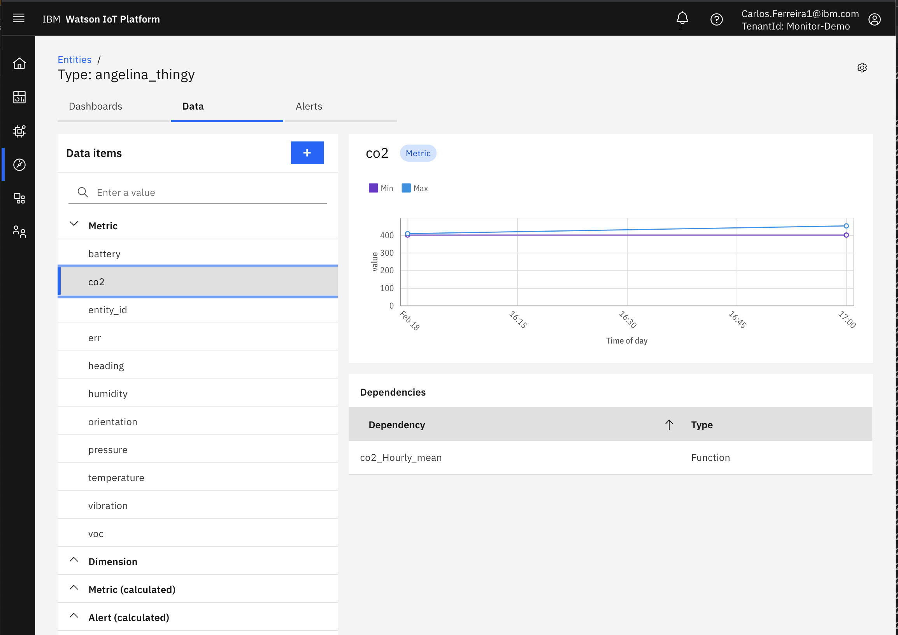

# View Data
Now that you know the data is successfully flowing into IOT Platform Service, it is time to take a look at that data Maximo Asset Manager dashboards. Go to Maximo Asset Monitor page.

1. Click `Monitor`. Here you can see all of the entity types created from the [logical interfaces](https://www.ibm.com/support/knowledgecenter/SSQP8H/iot/developing/connect.html).  An entity is created for each mapped device ID along with it's corresponding properties.
2.  Search for your Entity Type `<your last name>_thingy`
 &nbsp;  
3.  Click on`<your last name>_thingy` row in the table for your entity type
 &nbsp;  
4.  Since you only have one device for Thingy Entity Type `<your last name>_thingy`, only one entity is listed on the `Dashboards` tab in the `Instance Dashboard` table on `Entities Type` page for your Entity Type.  As you add more devices to the `<your last name>_thingy` Device Type in IOT Platform they will appear on the entities page.  Any entity can be an asset, an IO Point, a system of assets or what ever you choose.
 &nbsp;   
5.  Click on the `Data` Tab and expand `Metrics` to see all the aggregated metrics across all your devices like the max and min values for time series float data.
6.  Scroll down a bit to view the metric charts for `co2`, `pressure` and `temperature`.  Click on `co2`to see its max an min over time aggregated across all entities in `<your last name>_thingy` Entity Type.
 &nbsp;
7.  Click the `Dashboards` tab to return to see the list of `Entities` in the `Instance Dashboards` table.  
8.  Select your Thingy entity listed in the `Instance Dashboards` table.  Now you only see the data for this specific asset.  The `Dimensions` tab shows the meta data used to classify your asset.  
 &nbsp;
9.  Click `Metrics` tab to see metrics for the last 24 hours for only this asset or IO Point. It may take it time to accrue enough data to visualize, take a break and return after ten or so minutes.
 &nbsp;  

# Analyze Data
Now that you have device data, it is time to further analyze and process that data so that remote operations managers can take action using intelligent insights.  

1. Click `Monitor`. Here you can see all of the entity types created from the [logical interfaces](https://www.ibm.com/support/knowledgecenter/SSQP8H/iot/developing/connect.html).  An entity is created for each mapped device ID along with it's corresponding properties.
2.  Search for your Entity Type `<your last name>_thingy`
 &nbsp;  

## Create a Monitor Dashboard

Inside of your Entity Type homepage, right when you log in for the first time you will see a Dashboard card called `Hourly`. Upon clicking on the card, you will most likely see a dashboard that looks like this:

If you complete the full length Hands on Lab, your dashboard will look something like this. Today, we’ll get you on the right track:

### Add Line Graph Cards
Time series data is represented well as line graphs. Let's display the the critical performance metrics the Thingy is providing so that we can see historical trends and in later labs apply ai models to detect anomalies.

1.  Navigate back to the landing page for your entity type. You will see under “Summary Dashboards” an option to create a new dashboard. Click `+New Summary`.
2.  Next to `Definition`, click `Contents`. Select which data you would like to graphed on your dashboard.  
3.  Select which aggregation methods  you would like to see on your line graphs for each of your data types (You created these in the Analytics Service chapters).
4.  Now, click `Dashboard` next to contents. You can drag and drop the line graph cards that you just made in whichever orientation you see fit.
5.  Once you are content with your dashboard layout, click `Create Summary`. After a few minutes, you will end up with the beginnings of a sophisticated and value driven dashboard.
6.  Copy and paste the JSON lines 3 to 158 from “Monitor Final JSON without Image.json” into the top of the card array of your exported JSON. Copy and paste the JSON from my file beginning at the curly brace on line 3.

You are adding a few value cards to your dashboard. Please refer to the Full Hands on Lab in the Box folder if you would like to go through the whole lab.

Be careful of your commas, curly braces, and brackets or your JSON will get angry. In Atom, you can click on the curly brace at the top of your value card and it will underline that brace blue along with the last curly brace of the card. Make sure to put a comma after the last curly brace before the beginning of the next card.

You have finished the  "Operational Monitoring of Assets" lab.
