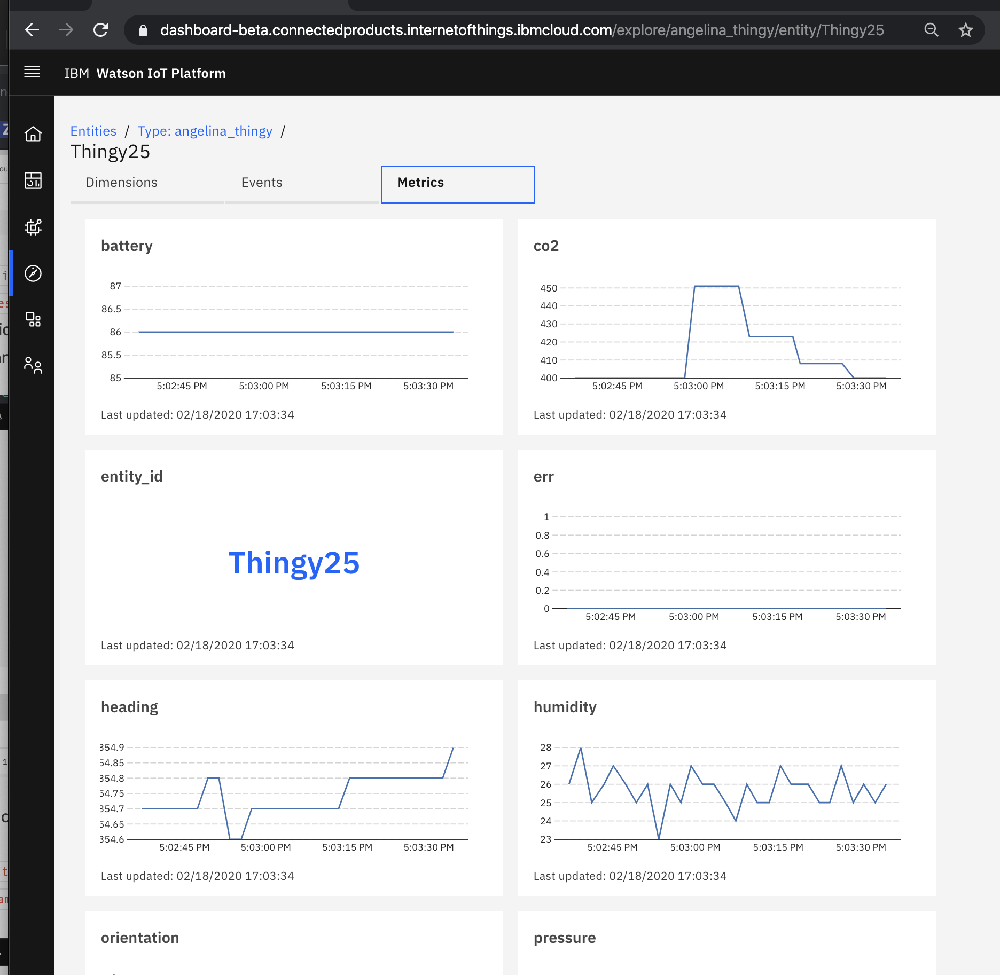
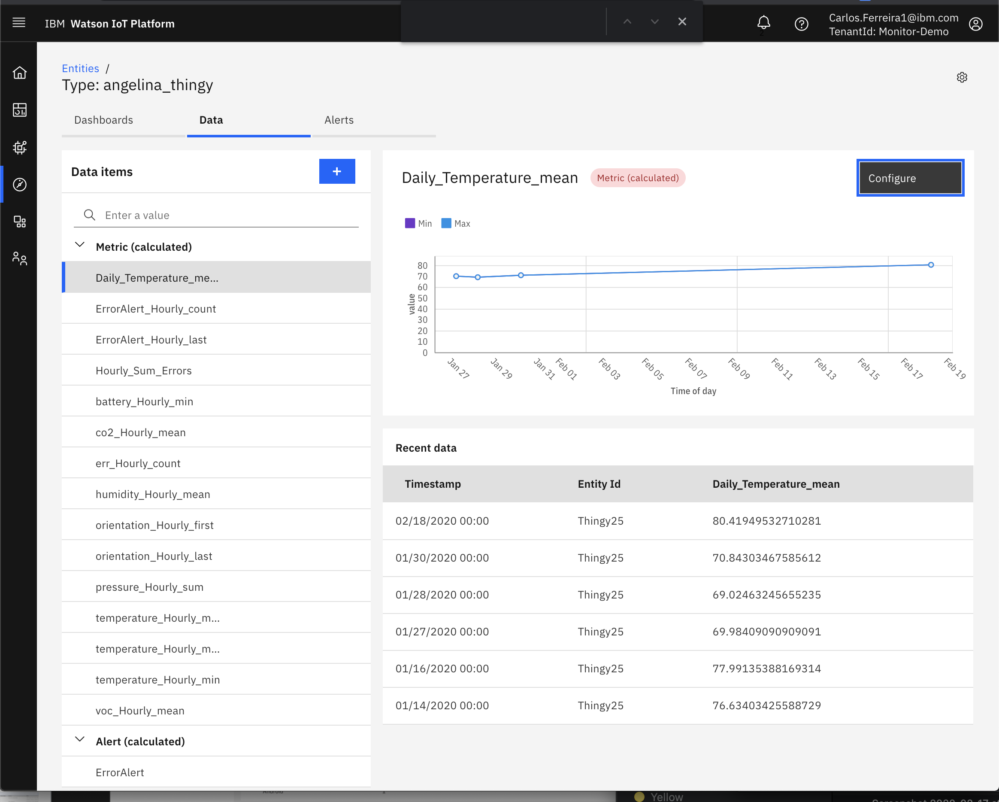
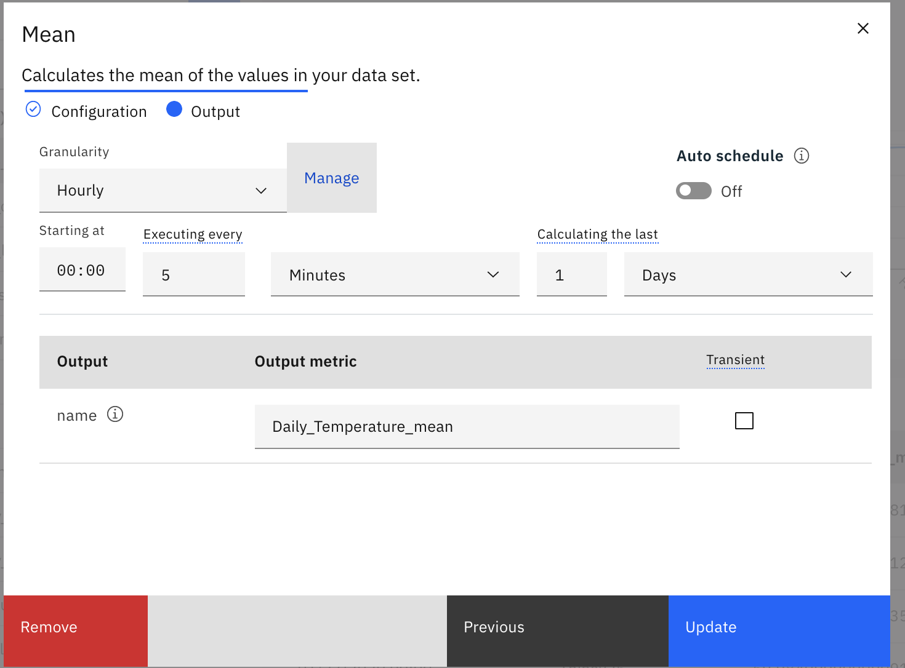
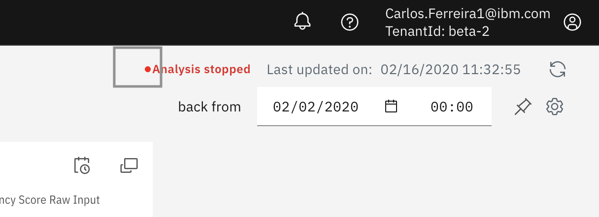

# Objectives
In this lab you will learn about:

* What data dashboards are automatically created for you
* How to perform data analysis using functions catalog
* How to be alerted about non-conforming asset conditions
* Troubleshoot functions
---
*Before you begin:*  
This lab requires that you have completed Lab 1 Connected Devices
---

# View Data
Now that you know the data is successfully flowing into IOT Platform Service, in this exercise you will see what data dashboards are automatically created for you. Go to Maximo Asset Monitor page.

1. Click `Monitor`. Here you can see all of the entity types created from the [logical interfaces](https://www.ibm.com/support/knowledgecenter/SSQP8H/iot/developing/connect.html).  An entity is created for each mapped device ID along with it's corresponding properties.
2.  Search for your Entity Type `<your last name>_thingy`
 &nbsp;  
3.  Click on`<your last name>_thingy` row in the table for your entity type
 &nbsp;  
4.  Since you only have one device for Thingy Entity Type `<your last name>_thingy`, only one entity is listed on the `Dashboards` tab in the `Instance Dashboard` table on `Entities Type` page for your Entity Type.  As you add more devices to the `<your last name>_thingy` Device Type in IOT Platform they will appear on the entities page.  Any entity can be an asset, an IO Point, a system of assets or what ever you choose.
 &nbsp;   
5.  Click on the `Data` Tab and expand `Metrics` to see all the aggregated metrics across all your devices like the max and min values for time series float data.
6.  Scroll down a bit to view the metric charts for `co2`, `pressure` and `temperature`.  Click on `co2`to see its max an min over time aggregated across all entities in `<your last name>_thingy` Entity Type.
 &nbsp;
7.  Click the `Dashboards` tab to return to see the list of `Entities` in the `Instance Dashboards` table.  
8.  Select your Thingy entity listed in the `Instance Dashboards` table.  Now you only see the data for this specific asset.  The `Dimensions` tab shows the meta data used to classify your asset.  
 &nbsp;
9.  Click `Metrics` tab to see metrics for the last 24 hours for only this asset or IO Point. It may take it time to accrue enough data to visualize, take a break and return after ten or so minutes.
 &nbsp;  

# Analyze Data
In the previous exercise you saw how you can see the raw device data in Monitor Dashboards, in this exercises you will learn how perform data analysis and transform data so that remote operations managers can take action using intelligent insights.  

1.  Click `Monitor`. Here you can see all of the entity types created from the [logical interfaces](https://www.ibm.com/support/knowledgecenter/SSQP8H/iot/developing/connect.html).  An entity is created for each mapped device ID along with it's corresponding properties.
2.  Search for your and click on your Entity Type `<your last name>_thingy`
 &nbsp;   
3.  Click `Data` tab  on the homepage for your Entity Type.
 &nbsp;  
4.  You can start tracking the mean of the entities across your Entity Type by creating a calculated metric from the Function Catalogue.
5.  Click `+` button access the Function Catalog.  Select the `Mean` function from the catalog. 
 &nbsp;
6.  Click `Select`.
 &nbsp;
7.  In the next dialog, select the metric that you want to calculate the daily mean for. In this case, `Temperature` and click `Next`.
 &nbsp;
8.  Since temperature is changing and recorded over time you need to specify what time period the mean is being calculated for.   This is called the granularity and you can leave it set to `Daily` to calculate the daily mean.
 &nbsp;
9.  Replace the calculated `output metric` name with your own like `Daily_Temperature_Mean`
10.  Leave everything else as default and click `Create` to save the metric.  This calculated metric is calculating a daily mean. If you wanted to calculate an `Hourly_Temperature_Mean`, you can set the `Granularity` to `Hourly` on the output dialog.
11.  You should now see your new calculated metric in the metrics list on the left-hand side.
12.  Click the `Configure` button to update calculated metrics.
 &nbsp;  
13.  Click `Next` and `Schedule` icon to change the schedule of how often the mean is calculated.  You can change the frequency of how often hourly mean is calculated changing it from every 5 minutes to every hour.   You can also change how many days back the mean temperature function should calculate for using historical temperature data.    
 &nbsp;  
14.  Click `Update` to save your function configuration changes.
---
**Note:**
Calculated functions by default are scheduled to run every 5 minutes.  Check back to later see if the metric is being calculated.
---
 Congratulations.  You have learned how to view the metrics of your entities as well as create new, calculated metrics from that data.

# Alerts

In this exercises you will learn how to create alerts. Alerts are a function in the Maximo Asset Monitor catalog that can be configured to notify you that certain asset conditions require attention.  There are a many types of alert functions included in the catalog like `High`, `Low` and `Alert Expression Filter`.  Like other functions in the catalog, these alerts can be scheduled to run every five minutes or less frequently.  This is unlike Actions in the IOT Platform Service notifications that are invoked immediately when event data is ingested. Actions have an application programming interface to integrate with other systems.  You can also create you and register your custom functions in the Maximo Asset Monitor catalog.  Both of these are advanced topics that are beyond the scope of this lab. You can learn more about how to create custom functions in this [tutorial](https://www.ibm.com/support/knowledgecenter/en/SSQP8H/iot/analytics/tutorials/as_adding_complex_function_tutorial.html)  You can also explore a sample Hello World custom function in [GitHub](https://github.com/madendorff/functions)

1. Use what you learned in the previous exercise to create a calculated metric named `Hourly_Sum_Errors` to sum up all the alert errors created by pressing the button on your Nordic Thingy using the `Sum` function in the Catalog.  After you will create an alert to be notified when the hourly sum of errors exceeds 10 using the instructions below.
2. Configure an alert using the value of a metric-name `Hourly_Sum_Errors` created in the previous step.  &nbsp;  
3. Click `+` button access the Function Catalog.   &nbsp;  
4. Search on `Alert`
5. Select the `AlertExpression` function and then click `Select` button.   &nbsp;  
6. Configure the alert to trigger an alert when the value of a metric-name `Hourly_Sum_Errors`reaches 24 errors.  It will require investigation of the errors.  Monitor uses Python for its expression language  Using the format `df['metric-name']`
7.  Set Alert Expression `expression` value to `df['Hourly_Sum_Errors']>24`
8.  Set Alert Expression `Severity` value to `df['Hourly_Sum_Errors']>24`
df['Hourly_Sum_Errors']>24
9.  Set Alert Expression `Status` value to `New`  Alerts start in state of `new` until they are `acknowledged`, `validated` and finally `resolved` or `dismissed`  &nbsp;  
10.  Name the alert `Hourly_Sum_Errors_Alert`  The Monitor pipeline runs every 5 minutes.  If you have flipped over your Thingy more than five times, you should see the alert show up on the chart in about five minutes.   &nbsp;

Congratulations.  You have learned how to create new Alerts from a calculated metric that sums the total number of errors that occur on an asset device.  You can also receive alerts on a device event stream topic and take action. That is beyond the scope of these materials. Find out more information on how to configure these actions in the [documentation](https://www.ibm.com/support/knowledgecenter/en/SSQP8H/iot/analytics/as_custom_actions.html)

# Troubleshoot Functions

1.  Should you see `Analysis Stopped` warning this means your pipeline for your entity type has stopped calculating your metrics. You should click on `Analysis Stopped red dot ` to view the error details.   &nbsp;
2.  These warnings often occur because a calculated metric function input argument depends on a metric name that has been deleted or whose name has changed.   
3.  Click on `Search glass` icon in the data field to find the metric name that is causing the problem.  Make sure it exists or choose the new metric name in the calculated metric that uses it.

Paulina
