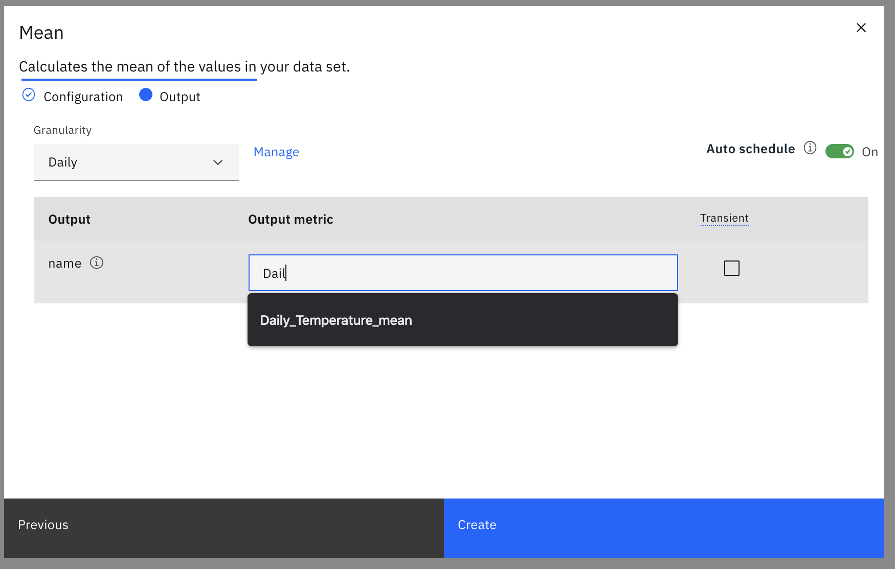
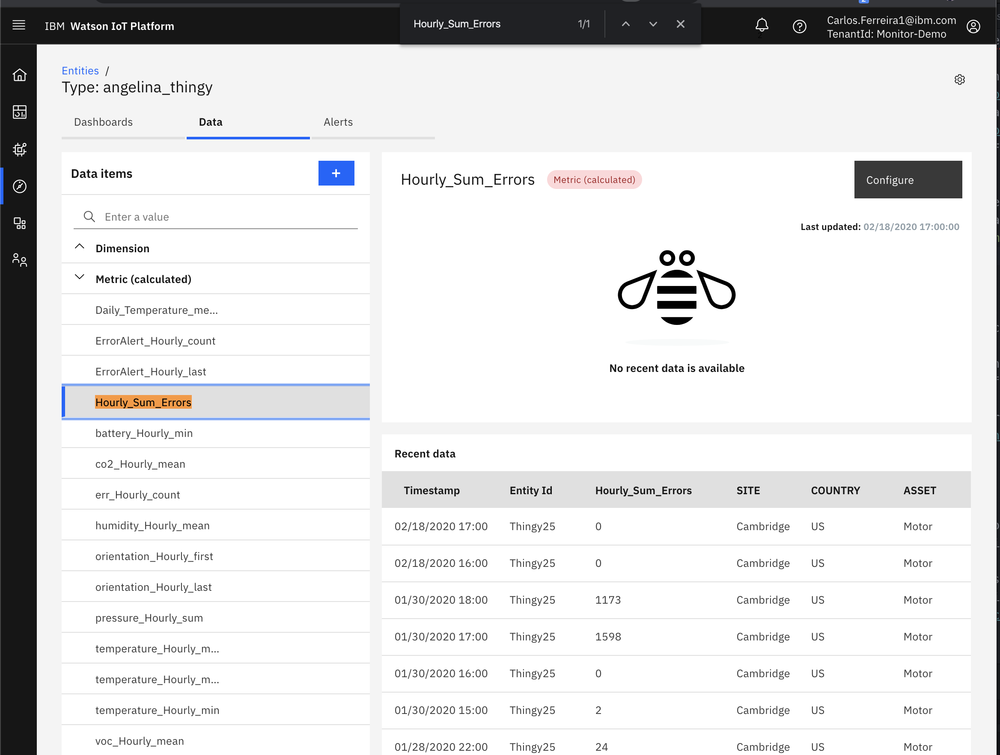
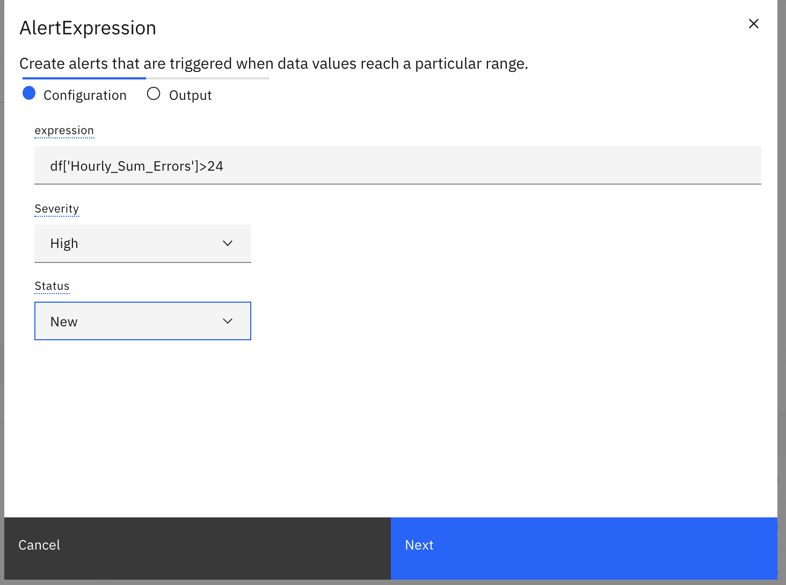
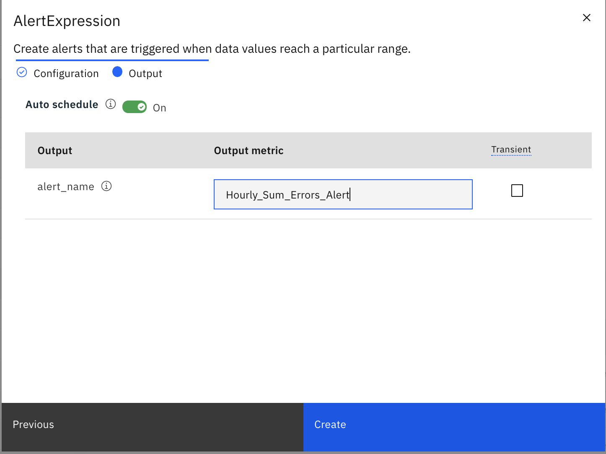
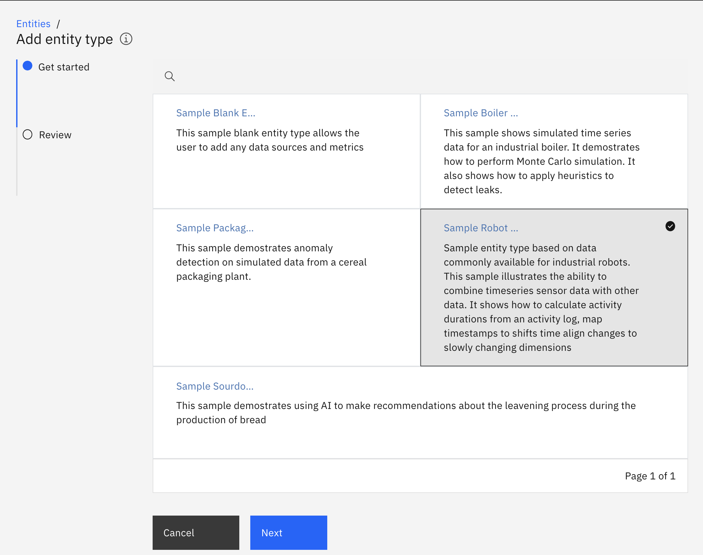

# View Data
Now that you know the data is successfully flowing into IOT Platform Service, in this exercise you will see what data dashboards are automatically created for you in Maximo Asset Manager dashboards. Go to Maximo Asset Monitor page.

1. Click `Monitor`. Here you can see all of the entity types created from the [logical interfaces](https://www.ibm.com/support/knowledgecenter/SSQP8H/iot/developing/connect.html).  An entity is created for each mapped device ID along with it's corresponding properties.
2.  Search for your Entity Type `<your last name>_thingy`
 &nbsp;  
3.  Click on`<your last name>_thingy` row in the table for your entity type
 &nbsp;  
4.  Since you only have one device for Thingy Entity Type `<your last name>_thingy`, only one entity is listed on the `Dashboards` tab in the `Instance Dashboard` table on `Entities Type` page for your Entity Type.  As you add more devices to the `<your last name>_thingy` Device Type in IOT Platform they will appear on the entities page.  Any entity can be an asset, an IO Point, a system of assets or what ever you choose.
 &nbsp;   
5.  Click on the `Data` Tab and expand `Metrics` to see all the aggregated metrics across all your devices like the max and min values for time series float data.
6.  Scroll down a bit to view the metric charts for `co2`, `pressure` and `temperature`.  Click on `co2`to see its max an min over time aggregated across all entities in `<your last name>_thingy` Entity Type.
 &nbsp;
7.  Click the `Dashboards` tab to return to see the list of `Entities` in the `Instance Dashboards` table.  
8.  Select your Thingy entity listed in the `Instance Dashboards` table.  Now you only see the data for this specific asset.  The `Dimensions` tab shows the meta data used to classify your asset.  
 &nbsp;
9.  Click `Metrics` tab to see metrics for the last 24 hours for only this asset or IO Point. It may take it time to accrue enough data to visualize, take a break and return after ten or so minutes.
 &nbsp;  

# Analyze Data
In the previous exercise you saw how you can see the raw device data in Monitor Dashboards, in this exercises you will learn how perform data analysis and transform data so that remote operations managers can take action using intelligent insights.  

1.  Click `Monitor`. Here you can see all of the entity types created from the [logical interfaces](https://www.ibm.com/support/knowledgecenter/SSQP8H/iot/developing/connect.html).  An entity is created for each mapped device ID along with it's corresponding properties.
2.  Search for your and click on your Entity Type `<your last name>_thingy`
 &nbsp;  
3.  You can the mean of a metric by creating a calculated metric by selecting the `Mean` function from the catalog.  
4.  Click `Data` tab  for your and click on your Entity Type `<your last name>_thingy`
 &nbsp;  
5.  Click `+` button access the Function Catalog.
 &nbsp;
6.  Search on `Mean`
 &nbsp;
7.  Select the `Mean` function and then click `Select` button.
8.  In the next dialog, select the metric that you want to calculate the daily mean for. In this case, `Temperature` and click `Next`.
 &nbsp;
9.  Since temperature is changing and recorded over time you need to specify what time period the mean is being calculated for.   This is called the granularity and you can leave it set to `Daily` to calculate the daily mean.
 &nbsp;
10.  Replace the calculated `output metric` name with your own like `Daily_Temperature_Mean`
11.  Leave everything else as default and click `Create` to save the metric.  This calculated metric is calculating a daily mean. If you wanted to calculate an `Hourly_Temperature_Mean`, you can set the `Granularity` to `Hourly` on the output dialog.
12.  You should now see your new calculated metric in the metrics list on the left-hand side.
13.  Click the `Configure` button to update calculated metrics.
 &nbsp;  
14.  Click `Next` and `Schedule` icon to change the schedule of how often the mean is calculated.  You can change the frequency of how often hourly mean is calculated changing it from every 5 minutes to every hour.   You can also change how many days back the mean temperature function should calculate for using historical temperature data.    
 &nbsp;  
15.  Click `Update` to save your function configuration changes.
---
**Note:**
Calculated functions by default are scheduled to run every 5 minutes.  Check back to later see if the metric is being calculated.
---
 Congratulations.  You have learned how to view the metrics of your entities as well as create new, calculated metrics from that data.

# Alerts

In this exercises you will learn how to create alerts. Alerts are function in the catalog that can be configured to notify you that certain asset conditions that requires attention.  There are a variety of alert functions included in the catalog like `High`, `Low` and `Alert Expression Filter`.  These alerts are functions that can be scheduled to run every five minutes or less frequently.  Unlike IOT Platform Service notifications, that are invoked immediately when data is ingested into the Kafka streams and provide an `Action` application programming interface to integrate with other systems.

1. Use what you learned in the previous exercise to create a calculated metric named `Hourly_Sum_Errors` to sum up all the alert errors created by pressing the button on your Nordic Thingy using the `Sum` function in the Catalog.  After you will create an alert to be notified when the hourly sum of errors exceeds 10 using the instructions below.
2. Configure an alert using the value of a metric-name `Hourly_Sum_Errors` created in the previous step.  &nbsp;  
3. Click `+` button access the Function Catalog.   &nbsp;  
4. Search on `Alert`
5. Select the `AlertExpression` function and then click `Select` button.   &nbsp;  
6. Configure the alert to trigger an alert when the value of a metric-name `Hourly_Sum_Errors`reaches 24 errors.  It will require investigation of the errors.  Monitor uses Python for its expression language  Using the format `df['metric-name']`
7.  Set Alert Expression `expression` value to `df['Hourly_Sum_Errors']>24`
8.  Set Alert Expression `Severity` value to `df['Hourly_Sum_Errors']>24`
df['Hourly_Sum_Errors']>24
9.  Set Alert Expression `Status` value to `New`  Alerts start in state of `new` until they are `acknowledged`, `validated` and finally `resolved` or `dismissed`  &nbsp;  
10.  Name the alert `Hourly_Sum_Errors_Alert`  The Monitor pipeline runs every 5 minutes.  If you have flipped over your Thingy more than five times, you should see the alert show up on the chart in about five minutes.   &nbsp;

Congratulations.  You have learned how to create new Alerts from a calculated metric that sums the total number of errors that occur on an asset device.  You can also receive alerts on a device event stream topic and take action. That is beyond the scope of these materials. Find out more information on how to configure these actions in the [documentation](https://www.ibm.com/support/knowledgecenter/en/SSQP8H/iot/analytics/as_custom_actions.html)

You can also create you and register your custom functions in the catalog.  This is an advanced topic and goes beyond the scope of this lab. You can learn more in this tutorial for creating custom functions in the  [documentation](https://www.ibm.com/support/knowledgecenter/en/SSQP8H/iot/analytics/tutorials/as_adding_complex_function_tutorial.html)  You can also explore a sample Hello World custom function in [GitHub](https://github.com/madendorff/functions)

# Troubleshoot Functions

# Create a Monitor Instance Dashboard

In this exercises you will learn how to create summary dashboards that aggregate data across multiple entities (Thingies) within your Entity Type homepage, right when you log in for the first time you will see a Dashboard card called `Hourly`. Upon clicking on the card, you will most likely see a dashboard that looks like this:

If you complete the full length Hands on Lab, your dashboard will look something like this. Today, we’ll get you on the right track:

1.  Click `Home`. Here you can see the top level tasks you can do in Monitor.  &nbsp;
2.  Click `Monitor Entities` You will create a simulated set of entities representing an assembly line of robots.
3.  Click `Create entity type` button.  &nbsp;
4.  Click `Create entity type` button.
5.  Select on `Sample Robot` and click on `Next`button.   &nbsp;
6.  Edit the Entity Type name prepending your own initials `Your_Initials_Robots_Type`. &nbsp;
7.  Click `Submit` button.  Monitor will create  a set of robots you can monitor with simulated random data.  
8.  Expand `Metric` to see the metrics that Monitor has created for your Robots with simulated time series data.  &nbsp;
9.  Expand  `Dimensions` to see the classifications Monitor has created to filter and summarize all the Robots key performance metrics like by `Manufacturer`.  &nbsp;
10.  Expand  `Metric (calculated)` to see the functions used to create the simulated data like generating a random number to cause a fault like `abnormal_stop_count`. 
11.  Click the `Dashboards` tab to  to see the list of `Entities`(Robots) in the `Instance Dashboards` table.
Click
12.  Click on one of the Robot instance dashboards that have been automatically created for you by Monitor  
13.  Click on the gear icon to modify the layout of your Robot instance dashboard.  This dashboard template is shared by all robots in your Entity Type. 

# Create a Monitor Summary Dashboard

## Add Line Graph Cards
Time series data is represented well as line graphs. Let's display the the critical performance metrics the Thingy is providing so that we can see historical trends and in later labs apply ai models to detect anomalies.

1.  Navigate back to the landing page for your entity type. You will see under “Summary Dashboards” an option to create a new dashboard. Click `+New Summary`.
2.  Next to `Definition`, click `Contents`. Select which data you would like to graphed on your dashboard.  
3.  Select which aggregation methods  you would like to see on your line graphs for each of your data types (You created these in the Analytics Service chapters).
4.  Now, click `Dashboard` next to contents. You can drag and drop the line graph cards that you just made in whichever orientation you see fit.
5.  Once you are content with your dashboard layout, click `Create Summary`. After a few minutes, you will end up with the beginnings of a sophisticated and value driven dashboard.
6.  Copy and paste the JSON lines 3 to 158 from “Monitor Final JSON without Image.json” into the top of the card array of your exported JSON. Copy and paste the JSON from my file beginning at the curly brace on line 3.

You are adding a few value cards to your dashboard. Please refer to the Full Hands on Lab in the Box folder if you would like to go through the whole lab.

Be careful of your commas, curly braces, and brackets or your JSON will get angry. In Atom, you can click on the curly brace at the top of your value card and it will underline that brace blue along with the last curly brace of the card. Make sure to put a comma after the last curly brace before the beginning of the next card.

You have finished the  "Operational Monitoring of Assets" lab.
